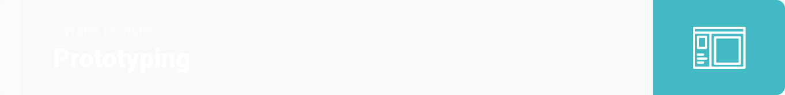

This is a summary that describes the Water Monster project.

**[PROJECT PHILOSOPHY](https://github.com/abdallahmoubarak/water-monster#project-philosophy) • [WIREFRAMES](https://github.com/abdallahmoubarak/water-monster#prototyping) • [TECH STACK](https://github.com/abdallahmoubarak/water-monster#tech-stack) • [IMPLEMENTATION](https://github.com/abdallahmoubarak/water-monster#implementation) • [HOW TO RUN?](https://github.com/abdallahmoubarak/water-monster#how-to-run)**

 

 Water Monster is a service app that can match water wanter and water provider. Using Water Monster users will never warry about how much water is their in the container.

### User Stories

### - Client:

- User shall be able to sign up, sign in, and request installation packages.
- User shall be able to view the real time water level in the container.
- User shall be able to accept service providers.
- User shall be able to view the over time records in a chart.
- User shall be able to set manual or auto filling mode.
- User shall be able to set private or public mode.
- User shall be able to edit profiles.
- User shall be able to recharge the wallet.
- User shall be able to see the state of each sensor container.
- User shall be able to chat with the provider and make a voice call.

### - Service provider:

- User shall be able to sign up, sign in.
- User shall be able to view a real time active containers on the map.
- User shall be able to view the level of the water for each.
- User shall be able to chat with client and make a voice call.
- User shall be able to see a path and calculate selected containers needed for water.
- User shall be able to see the wallet and withdraw.
- User shall verify the filling process by selecting the container and clicking on start filling.

### - Admin:

- Admin shall be able to review the package requests, and change the process state.(depending on each stage)
- Admin shall be able to view each service consumer and service provider information + statistics.
- Admin shall be able to chat with users.
- Admin shall be able to view states on map.
- Admin shall be able to view statistics of the system.

### 1- Sketching

| Sign up                              | Water level                                 | Wallet                              |
| ------------------------------------ | ------------------------------------------- | ----------------------------------- |
|  |  |  |

| System Model                                                  |
| ------------------------------------------------------------- |
|  |

See more sketches

| Map                           | Profile                               | Chat                               |
| ----------------------------- | ------------------------------------- | ---------------------------------- |
|  |  |  |

| Statistics                                  | Contacts                                | Setting                               |
| ------------------------------------------- | --------------------------------------- | ------------------------------------- |
|  |  |  |

| Requsets                                |
| --------------------------------------- |
|  |

| Users                             |
| --------------------------------- |
|  |

| Map                                |
| ---------------------------------- |
|  |

#

### 2- Wireframes

#

### 3- Mockups

| Sign up                               | Water level                                  | Wallet                               |
| ------------------------------------- | -------------------------------------------- | ------------------------------------ |
|  |  |  |

| Map                                | Profile                                   | Chat                               |
| ---------------------------------- | ----------------------------------------- | ---------------------------------- |
|  |  |  |

See more mockups

<table>
  <tr>
    <th>Statistics</th>
    <th>Contacts</th>
    <th>Setting</th>
  </tr>
  <tr>
    <td>
      
    </td>
    <td>
      
    </td>
    <td>
      
    </td>
  </tr>
</table>

<table>
  <tr>
    <th>Requsets</th>
  </tr>
  <tr>
    <td>
      
    </td>
  </tr>
</table>

<table>
  <tr>
    <th>Users</th>
  </tr>
  <tr>
    <td>
      
    </td>
  </tr>
</table>

<table>
  <tr>
    <th>Map</th>
  </tr>
  <tr>
    <td>
      
    </td>
  </tr>
</table>

#

### 4- Data Modeling

| Graph Data Model Diagram                                   |
| ---------------------------------------------------------- |
|  |

#

### 4- Electronics

| Ultrasonic Waterproof Sensor AJ-SR04M   | ESP8266                           | JSN-SR04T                             |
| --------------------------------------- | --------------------------------- | ------------------------------------- |
|  |  |  |

| Circuit                             |
| ----------------------------------- |
|  |

