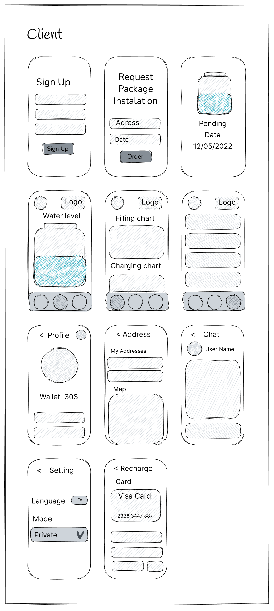
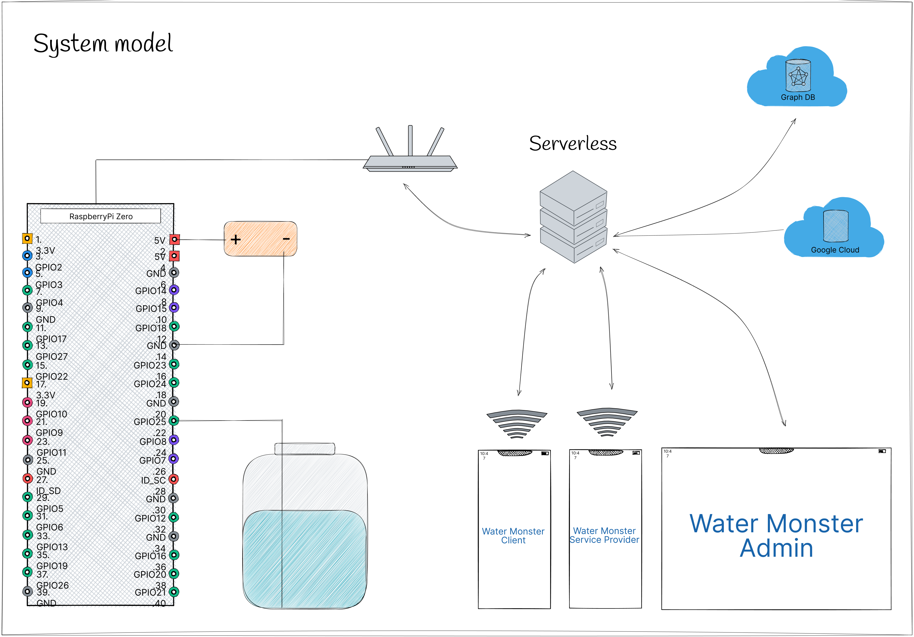
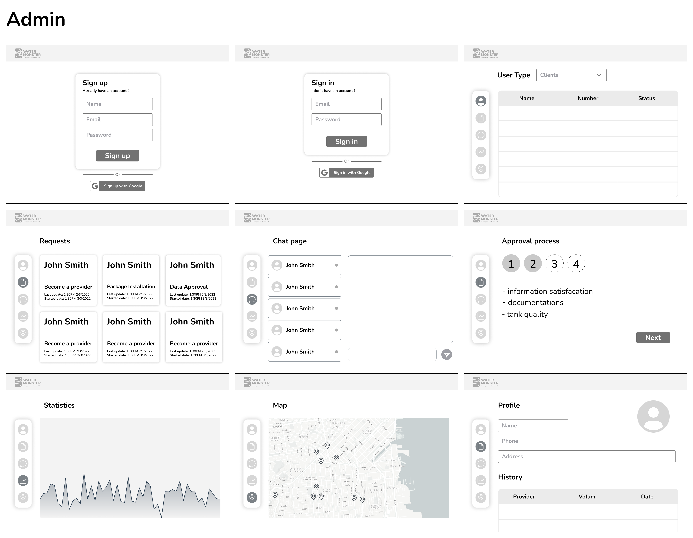

> This is a summary that describes the Water Monster project.

**[PROJECT PHILOSOPHY](https://github.com/abdallahmoubarak/water-monster#project-philosophy) • [WIREFRAMES](https://github.com/abdallahmoubarak/water-monster#prototyping) • [TECH STACK](https://github.com/abdallahmoubarak/water-monster#tech-stack) • [IMPLEMENTATION](https://github.com/abdallahmoubarak/water-monster#implementation) • [HOW TO RUN?](https://github.com/abdallahmoubarak/water-monster#how-to-run)**

  

> Water Monster is a service app that can match water wanter and water provider. Using Water Monster user will never warry about how much water is their in the container.

### User Stories

##### As a client:

- User shall be able to sign up, sign in, and request installation packages.
- User shall be able to view the real time water level in the container.
- User shall be able to accept service providers.
- User shall be able to view the over time records and the expenses as a (chart).
- User shall be able to set manual or auto filling mode.
- User shall be able to set private or public mode.
- User shall be able to edit profiles.
- User shall be able to recharge the wallet.
- User shall be able to see the state of each sensor container.
- User shall be able to chat with the provider and make a voice call.

##### As a service provider:

- User shall be able to sign up, sign in, and request an acceptance package.
- User shall be able to upload contract documents.
- User shall be able to view a real time map of active containers.
- User shall be able to view the level of the water for each.
- User shall be able to chat with client and make a voice call.
- User shall be able to see a path and calculate selected containers needed for water.
- User shall be able to see a wallet.
- User shall verify the filling process by selecting the container and clicking on start filling.

##### As an admin:

- Admin shall be able to accept a service provider according to the document's conditions.
- Admin shall be able to review the package requests, and change the process state.(depending on each stage)
- Admin shall be able to view each service consumer and service provider information + statistics.
- Admin shall be able to edit and accept edited data before change.
- Admin shall be able to view states on map.

### 1- Sketching

<table>
<tr>
<td>

</td>
<td>

</td>
</tr>

</table>

<table>
<tr>
<td>

</td>
<td>
</td>
</tr>
</table>

---

### 2- Wireframes

<table>
<tr><td>

</td>
</tr>
</table>

<table>
<tr><td>

</td>
<td>

</td>
</tr>
</table>

---

### 3- Mockups

<table>
<tr><td>

</td>
</tr>
</table>

<table>
<tr><td>

</td>
<td>

</td>
</tr>
</table>

---

### 4- Data Modeling

<table>
<td>

</td></table>

