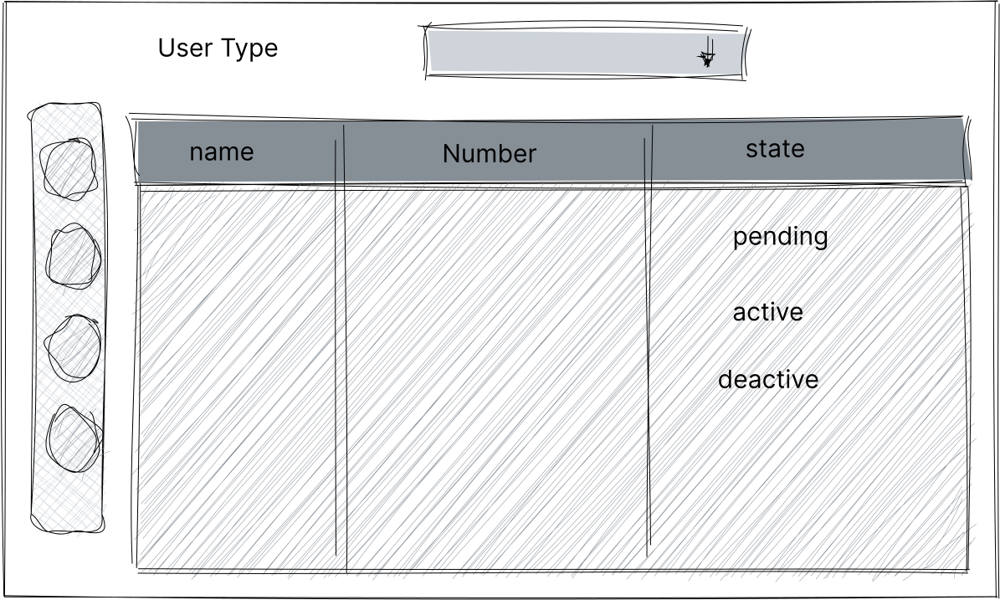
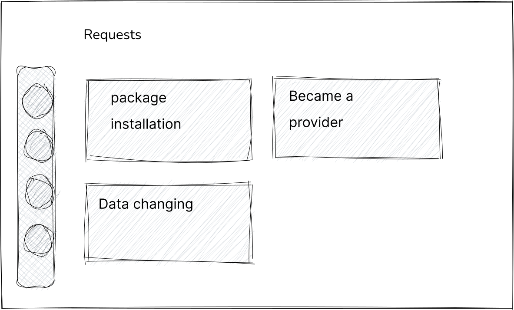
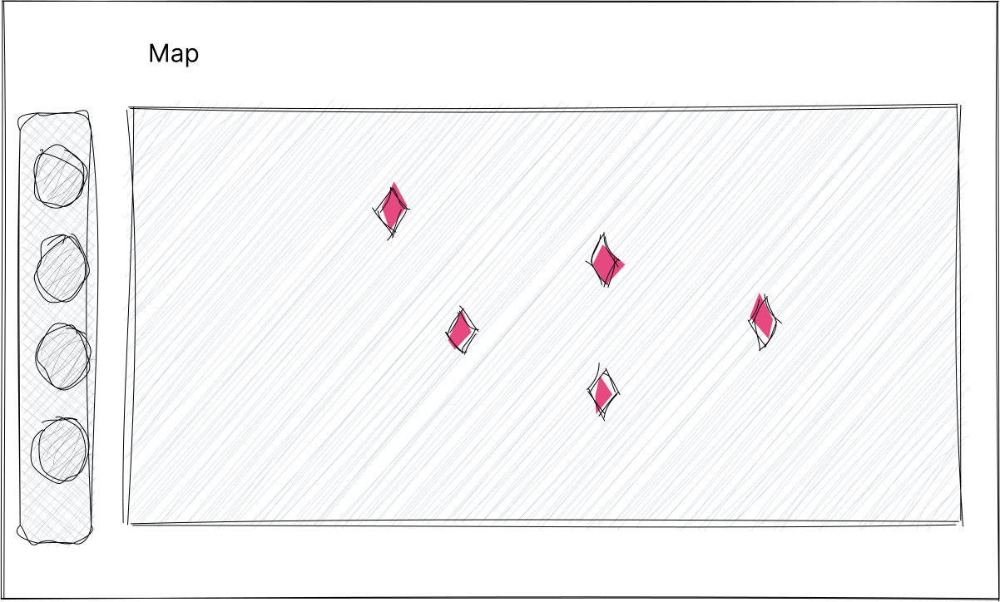
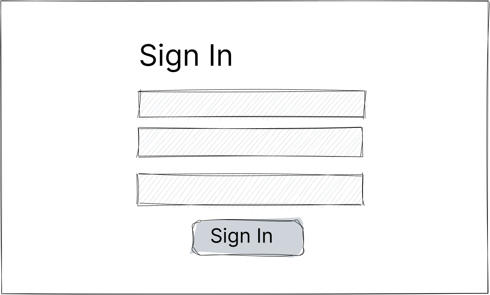
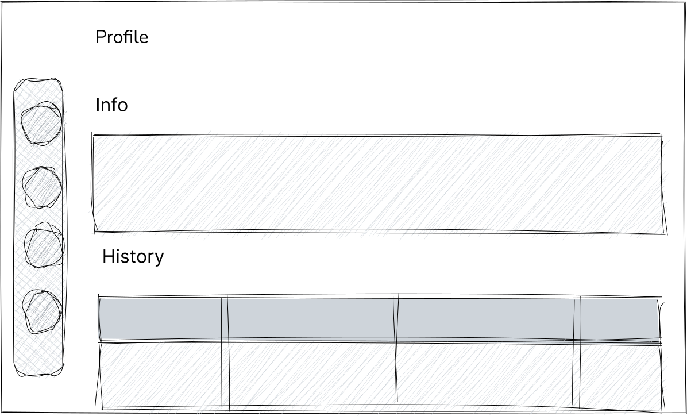
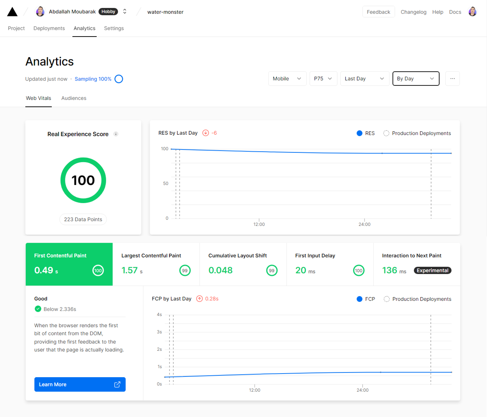

<div align="center">

This is a summary that describes the Water Monster project.

**[PROJECT PHILOSOPHY](https://github.com/abdallahmoubarak/water-monster#project-philosophy) • [WIREFRAMES](https://github.com/abdallahmoubarak/water-monster#prototyping) • [TECH STACK](https://github.com/abdallahmoubarak/water-monster#tech-stack) • [IMPLEMENTATION](https://github.com/abdallahmoubarak/water-monster#implementation) • [HOW TO RUN?](https://github.com/abdallahmoubarak/water-monster#how-to-run)**

</div>

<br>


<p align="center"> 
Water Monster is a platform that solves one of the main issues for those countries that rely on water containers; to provide home water. It helps users to control, track and ask for water refill. Moreover, it helps providers to sell the service, and gives them many options over a user-friendly application.

</p>

<p align="center"> 
Water Monster users will never warry about how much water is in their container !!!
</p>

#

### User Stories

User stories is the things that done before starting the project.

### - Client:

- User shall be able to sign up, sign in, and request installation packages.
- User shall be able to view the real time water level in the container.

<details><summary>read more</summary>

- User shall be able to accept service providers.
- User shall be able to view the over time records in a chart.
- User shall be able to set manual or auto filling mode.
- User shall be able to set private or public mode.
- User shall be able to edit profiles.
- User shall be able to recharge the wallet.
- User shall be able to see the state of each sensor container.
- User shall be able to chat with the provider and make a voice call.

</details>

### - Service provider:

- User shall be able to sign up, sign in.
- User shall be able to view a real time active containers on the map.

<details><summary>read more</summary>

- User shall be able to view the level of the water for each.
- User shall be able to chat with client and make a voice call.
- User shall be able to see a path and calculate selected containers needed for water.
- User shall be able to see the wallet and withdraw.
- User shall verify the filling process by selecting the container and clicking on start filling.

</details>

### - Admin:

- Admin shall be able to review the package requests, and change the process state.(depending on each stage)

<details><summary>read more</summary>

- Admin shall be able to view each service consumer and service provider information + statistics.
- Admin shall be able to chat with users.
- Admin shall be able to view states on map.
- Admin shall be able to view statistics of the system.

</details>

#


### 1- Sketching

| System Model                        |
| ----------------------------------- |
|  |

<details><summary>See more sketches</summary>

| Sign up                               | Water level                                  | Wallet                               |
| ------------------------------------- | -------------------------------------------- | ------------------------------------ |
|  |  |  |

| Map                            | Profile                                | Chat                                |
| ------------------------------ | -------------------------------------- | ----------------------------------- |
|  |  |  |

| Statistics                                   | Contacts                                 | Setting                                |
| -------------------------------------------- | ---------------------------------------- | -------------------------------------- |
|  |  |  |

| Users                                   |
| --------------------------------------- |
|  |

| Requsets                                      |
| --------------------------------------------- |
|  |

| Map                                 |
| ----------------------------------- |
|  |

| Sign In                                   |
| ----------------------------------------- |
|  |

| Profile                                      |
| -------------------------------------------- |
|  |

</details>

#

### 2- Wireframes

| Sign up                                | Water level                                   | Wallet                                |
| -------------------------------------- | --------------------------------------------- | ------------------------------------- |
|  |  |  |

<details><summary>See more wireframes</summary>

| Map                             | Profile                                 | Chat                                 |
| ------------------------------- | --------------------------------------- | ------------------------------------ |
|  |  |  |

| Statistics                                    | Contacts                                  | Setting                                 |
| --------------------------------------------- | ----------------------------------------- | --------------------------------------- |
|  |  |  |

</details>

#

### 3- Mockups

| Sign up                                | Water level                                   | Wallet                                |
| -------------------------------------- | --------------------------------------------- | ------------------------------------- |
|  |  |  |

| Map                                 | Profile                                    | Chat                               |
| ----------------------------------- | ------------------------------------------ | ---------------------------------- |
|  |  |  |

| Sign In                                    |
| ------------------------------------------ |
|  |

<details><summary>See more mockups</summary>

| Users                                    |
| ---------------------------------------- |
|  |

| Statistics                                    | Contacts                                  | Setting                                 |
| --------------------------------------------- | ----------------------------------------- | --------------------------------------- |
|  |  |  |

</details>

#

### 4- Data Modeling

| Graph Data Model Diagram                                   |
| ---------------------------------------------------------- |
|  |

#

### 4- Electronics

| Ultrasonic Waterproof Sensor AJ-SR04M   | ESP8266                           | JSN-SR04T                             |
| --------------------------------------- | --------------------------------- | ------------------------------------- |
|  |  |  |

<details><summary>Circuit</summary>


</details>

#


- The ability to scale with graph databases was the main reason to start this project using the GRAND Stack. Graph database enables businesses and start-ups to grow faster, change faster, and be technically agile.

| GRAND stack                        |
| ---------------------------------- |
|       |
|  |

- GraphQL is a query language that helps you retrieve specific data from your endpoint APIs in the way and structure you want. because of having a graph database this query method helps in establish connections with the database in the same way that it is structured.

- Reactjs is a front-end library that helps create reusable components, which helped in the scalability of the project.

- Apollo server is a library that helps to connect a GraphQL schema to an HTTP server in Node.js.

- Neo4j is the database management system that uses the graph as a structure for storing data.

- Extending the GRAND stack to be used in the Nextjs framework, The techs has been used is as below :

| Nextjs                          | Socketio                            | ReactQuery                              | Firbase(auth)                       | Arduino                           |
| ------------------------------- | ----------------------------------- | --------------------------------------- | ----------------------------------- | --------------------------------- |
|  |  |  |  |  |

- Nextjs is a framework that uses Reactjs for the frontend, and Nodejs for the backend. Nextjs helped in improving the performance of the project, and gives some extra abilities. It helped in generating static pages, server side rendering and client side rendering pages depending on the case.

  - SEO was done with the help of Nextjs which is not possible just by building a Reactjs application (not needed for Water Monster case).

  - Nextjs helped in deploying the application on a serverless, using vercel without even making any configuration.

  - This application was created as a Progressive Web App (PWA), which can be install on every operation system.

  - The results will be shown in implementation section.

- Socketio has been used to make the connectivity between app users be live over a defined socket, it helped to build a real-time chat and call.

- React-query has been used to manage queries and mutations side by side with graphqlclient library in the best way using custom hooks.

- Firebase (auth) has been used to make a single sign on (SSO) to the system. This was added to the main sign up, signin method. The system was not fully implemented due to the time limitation of the project.

- Arduino (ESP8266) has been used with waterproof ultrasonic sensor to measure the water level in the container.


Using the above-mentioned tech stacks and the wireframes built with Figma, the implementation of the app is shown as below, these are screen recordings from the real app.

##### Sexy features

| Real time call                             | Real time chat                             |
| ------------------------------------------ | ------------------------------------------ |
|  |  |

| Map                            | SSO with firebase                            | Chart                              |
| ------------------------------ | -------------------------------------------- | ---------------------------------- |
|  |  |  |

- Monster as a native app.
- Monster app size less than 400kb.

| PWA as native app                                   | PWA size (343kb)                                          | Profile image                              |
| --------------------------------------------------- | --------------------------------------------------------- | ------------------------------------------ |
|  |  |  |

| Hardware |
| -------- |
|          |

Pure components with animating with css

| SVG waves                          | Fliping Bank Card                         | Logo Loading                           |
| ---------------------------------- | ----------------------------------------- | -------------------------------------- |
|  |  |  |

##### Client App

##### Provider App

##### Admin App

##### Analytics

| Vercel Analytics                          |
| ----------------------------------------- |
|  |

| PWA Analytics                     |
| --------------------------------- |
|  |

##### Jira dashboard

|  |
| -------------------------- |


There is a few steps to be done, to build and run this project. It's mentioned below:

### Prerequisites

- Download and Install [Node.js](https://nodejs.org/en/)

- Create [Neo4j instance](https://neo4j.com/cloud/platform/aura-graph-database/?ref=nav-get-started-cta)

- npm
  ```sh
  npm install npm@latest -g
  ```

### Installation

1. Clone the repo

   ```sh
   git clone https://github.com/abdallahmoubarak/water-monster
   ```

2. Go to the dir

   ```sh
   cd water-monster/app
   ```

3. Build the project
   ```sh
   npm build
   ```
4. Include .env.local variables

   ```sh
   NEXT_PUBLIC_GOOGLE_API_KEY = XX
   NEXT_PUBLIC_GOOGLE_AUTH_DOMAIN = XX
   NEXT_PUBLIC_GOOGLE_PROJECT_ID = XX
   NEXT_PUBLIC_GOOGLE_STORAGE_BUCKET = XX
   NEXT_PUBLIC_GOOGLE_MESSAGEING_SENDER = XX
   NEXT_PUBLIC_GOOGLE_APP_ID = XX

   NEXT_PUBLIC_NEO4J_USER = XX
   NEXT_PUBLIC_NEO4J_PASSWORD = XX
   NEXT_PUBLIC_NEO4J_URI = XX

   NEXT_PUBLIC_JWT_SECRET= XX

   NEXT_PUBLIC_ENDPOINT =  XX
   NEXT_PUBLIC_BASEURL = XX
   ```

5. Run the project
   ```sh
   npm run dev --turbo
   ```
