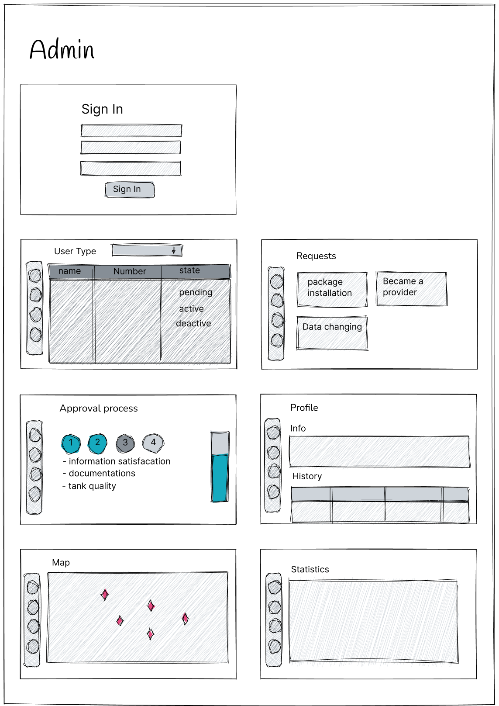
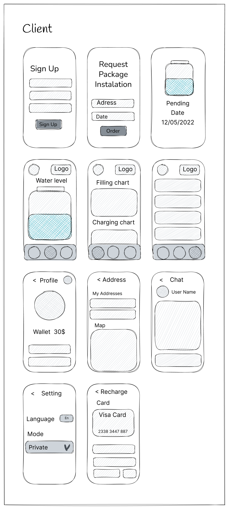
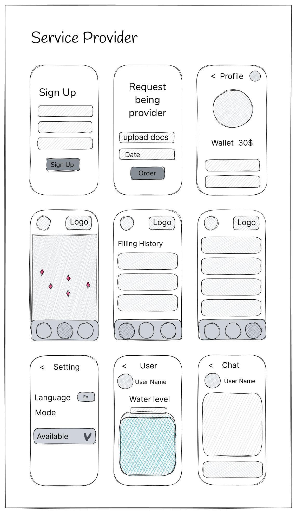
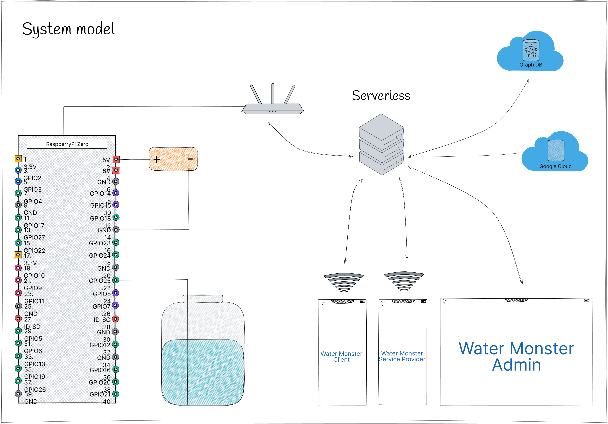
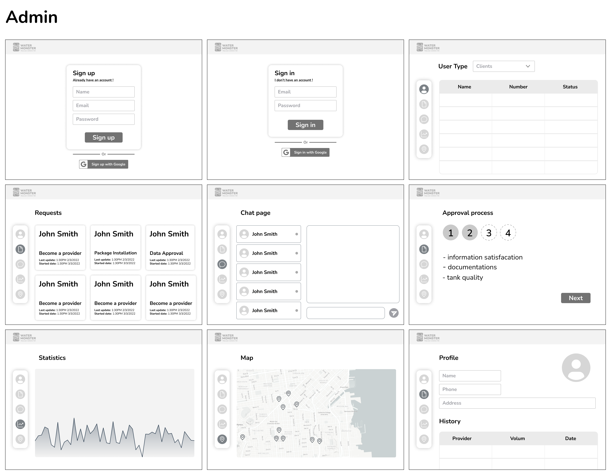
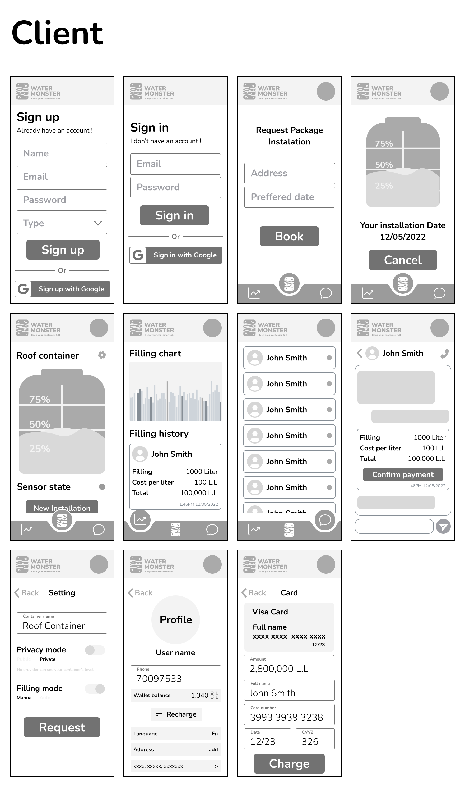

# Starting with Design Phase

In this phase we are going to create our models, system design, sketching, wireframe, and mockups.

---

### 1- User Story

Admin:

- Admin shall be able to accept a service provider according to the document's conditions.
- Admin shall be able to review the package requests, and change the process state.(depending on each stage)
- Admin shall be able to view each service consumer and service provider information + statistics.
- Admin shall be able to edit and accept edited data before change.
- Admin shall be able to view states on map.

Client:

- User shall be able to sign up, sign in, and request installation packages.
- User shall be able to view the real time water level in the container.
- User shall be able to accept service providers.
- User shall be able to view the over time records and the expenses as a (chart).
- User shall be able to set manual or auto filling mode.
- User shall be able to set private or public mode.
- User shall be able to edit profiles.
- User shall be able to recharge the wallet.
- User shall be able to see the state of each sensor container.
- User shall be able to chat with the provider and make a voice call.

Services Provider:

- User shall be able to sign up, sign in, and request an acceptance package.
- User shall be able to upload contract documents.
- User shall be able to view a real time map of active containers.
- User shall be able to view the level of the water for each.
- User shall be able to chat with client and make a voice call.
- User shall be able to see a path and calculate selected containers needed for water.
- User shall be able to see a wallet.
- User shall verify the filling process by selecting the container and clicking on start filling.

---

### 2- Sketching

---

### 3- Wireframes

---

### 4- Components

---

### 5- Mockups
