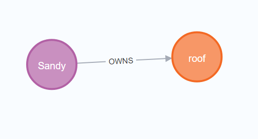
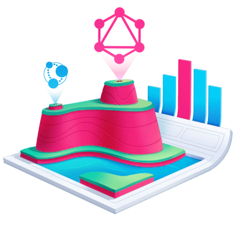

# Initializing Phase

In this phase we are going to create our elements, components, small projects that can help in building the main application.

---

### 1- Building nextjs-graphql-neo4j mini project

#### How to start the project

<details><summary>Details</summary>
<p>

##### First we go to the directory!

```bash
   cd .\src\project_phases\initializing_phase\nextjs-graphql-neo4j\
```

##### Installing node_modules!

```bash
   npm run build
```

##### Add .env file and add the variables to it

```bash
   NEO4J_USER= XX
   NEO4J_PASSWORD= XX
   NEO4J_URI = XX
```

##### Run the project!

```bash
   npm run dev
```

##### Go to browser

use : http://localhost:3000/api/graphql

there you go...

</p>
</details>

#### Important links

<details><summary>Details</summary>
<p>

- The following artical used for folder structuring : https://javascript.plainenglish.io/writing-a-node-js-graphql-backend-that-actually-scales-a-complete-guide-part-1-setup-cddceae25bdc

- For mixing GraphQL with Prisma : https://www.youtube.com/watch?v=RJpevpbC4YY

- Main link : https://lyonwj.com/blog/graphql-server-next-js-neo4j-aura-vercel

- Using GraphQL Interface And Union Types : https://github.com/neo4j-graphql/neo4j-graphql-js/blob/master/docs/graphql-interface-union-types.md

- Fullstack graphql : https://github.com/johnymontana/fullstack-graphql-neo4j-auradb-nextjs-vercel-workshop/blob/main/nextjs/pages/api/graphql.js

</p>
</details>

#### Queries and mutations

<details><summary>Details</summary>
<p>

##### Query

```graphql
query {
  users {
    name
    location {
      longitude
      latitude
    }
    createdAt
    containers {
      name
    }
  }
}
```

##### Mutation

```graphql
mutation {
  createUsers(
    input: [
      {
        name: "Sandy"
        location: { longitude: 22.128712, latitude: 19.121212 }
        containers: { create: [{ node: { name: "roof" } }] }
      }
    ]
  ) {
    users {
      id
      name
      location {
        longitude
        latitude
      }
      containers {
        id
        name
        size
      }
    }
  }
}
```

```graphql
mutation {
  updateUsers(
    where: { name: "Sandy" }
    update: { location: { longitude: 12.2123, latitude: 19.2323 } }
  ) {
    users {
      name
      location {
        longitude
        latitude
      }
    }
  }
}
```

</p>
</details>






---

### 2- Building nextjs-socketio mini project

#### How to start the project

<details><summary>Details</summary>
<p>

##### First we go to the directory!

```bash
   cd .\src\project_phases\initializing_phase\google-authentication-firebase
```

##### Installing node_modules!

```bash
   npm run build
```

##### Add .env file and add the variables to it

```bash

```

##### Run the project!

```bash
   npm run dev
```

</p>
</details>

#### Important links

<details><summary>Details</summary>
<p>

</p>
</details>
